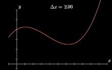

# gauss
Numerical Integration algorithms implemented in C++

Currently supports integration over discrete datasets as well as integration given a reference to a function.

The library intends to have similar numerical integration functions to MATLAB. It can be used almost identically to MATLAB, just in C++.

### What is currently implemented

* Riemann Sums (Left, Right, and Midpoint) (Composite)

* Trapezoidal Rule (Composite) (and the Cumulative Trapezoidal Rule for cumulative integration)

* Simpson's Rule(s) (1/3, 3/8) (Composite)

* Romberg's Method

## Motivation
Why would one wish to numerically compute an integral? 

* Some integrals cannot be expressed in terms of elementary functions.

* It would be very difficult to write a program to attempt to integrate like a human does

* Computational Speed

* May be given a dataset rather than an explicit integrand.

### An example

consider the integral 
$$\int_{-ln(2)}^{ln(2)}\frac{sin(x + x)^\frac{1}{3}}{e^x}dx$$

this integrand is unlikely to have a closed form solution for its anti-derivative, let alone a convinient one. 

Lets use a trapezoidal approximation from gauss to see what this integral is.

First we will need to define the integrand as a C++ function which takes a double, x, and returns a double

There is a catch, however, if we implement it as 

```C++
#include <cmath>

double f(double x) {
    return std::pow(sin(x + x), 1.0/3.0) / exp(x);
}
```

the approximation will fail. Upon further inspection you will notice that for negative arguments the function returns nan. This is because sin(x + x) will be negative. std::pow() returns NaN when the base is negative and the exponent is not an integer. 

To get around this we can just take the cube root of sin(x + x)

and the implementation is then 

```C++
#include <cmath>

double f(double x) {
    return cbrt(sin(x + x)) / exp(x);
}
```

For an approximation using gauss

```C++
// f is assumed to be already defined elsewhere as the above function

int main(void) {
    double integral = trapz(&f, 25, -log(2.0), log(2.0));
    std::cout << integral << std::endl;
}
```

the integral is then approximately -0.46573.

## Riemann Summations
The Riemann sum approximates the definite integral of a function f over an interval [a, b] by summing up the areas of N rectangles

In general, for a partition of [a, b], $P = (x_0, x_1, x_2, ... , x_N)$    

where $x_0=a, x_N=b$
and $x_0 < x_1 < x_2 < ... < x_{N-1} < x_N$

The Riemann sum approximation is given as
$$\int_a^bf(x)dx \approx \sum_{i=0}^Nf(x_i^*)\Delta x_i$$

where $x_i^* \in [x_{i-1}, x_i]$
and $\Delta x_i$ is given as $x_i - x_{i-1}$

What differentiates the different Riemann Summation rules is the choices of $x_i^*$ 

### Riemann Sum implementations
Using the right Riemann sum is easy
```cpp
double f(double x) {
    return x*x;
}

int main(void) {
    // given a reference to a function
    // integrate x^2 from 1 to 5 using 25 Riemann boxes with the Right Riemann Sum
    double right_riemann = rrie(&f, 25, 1, 5);
}
```

The left Riemann Sum and MidPoint Rule are also implemented, below are the function signatures

```cpp
// Midpoint Rule (Middle Riemann Sum)
//               f(x)             N     a        b
double mrie(double (*f)(double), int, double, double);
// Left Riemann Sum 
double lrie(double (*f)(double), int, double, double);
```

the usage is identical to rrie();

## Simpson's Rule
Simpson's $\frac{1}{3}$ and $\frac{3}{8}$ Rules are implemented for integration functions

Simpson's Composite one third rule approximates the definite integral by summing up the areas of N quadratic interpolants. Symbolically it is given as

$$\int_a^bf(x)dx \approx \frac{h}{3} * [f(a) + 4f(x_1) + 2f(x_2) + 4f(x_3) + ... + 4f(x_{N-1}) + f(b)]$$
where
$$h = \frac{b - a}{N}$$
$$x_i = a + i*h$$
and N is an even integer

<p align="center">
    
</p>

### Usage
```cpp
double f(double x) {
    return x*x;
}

int main(void) {
    double integral = simp13(&f, 24, 1, 5);
}
```
(Note: if the argument N is a non-even integer there will be an Assertion Error)

### Simpson's 3/8ths rule

Simpson's 3/8ths rule uses cubic interpolants rather than quadratic ones.
Symbolically it is
$$\int_a^bf(x)dx \approx \frac{3}{8}h*[f(a) + 3f(x_1) + 3f(x_2) + 2f(x_3) + ... + 2f(x_{N-3}) + 3f(x_{N-2}) + 3f(x_{N - 1}) + f(b)]$$

#### Usage
```cpp
double f(double x) {
    return x*x;
}

int main(void) {
    double integral = simp38(&f, 24, 1, 5);
}
```

## trapz
The Trapezoidal rule approximates the definite integral of a function f over an interval [a, b] by summing up the areas of N trapezoids.

Symbolically it is given as:

$$\int_a^bf(x)dx \approx \frac{b-a}{2N} \sum_{n=1}^{N}[f(x_n)+f(x_{n+1})]$$

$$= \frac{b-a}{2N}[f(x_1) + 2f(x_2) + ... + 2f(x_{N-1}) + f(x_{N})]$$

and the spacing between $x_i$ and $x_j$ is $\frac{(b - a)}{N}$

if the spacing between the trapezoids is not a constant the rule is generalized as:
$$\int_a^bf(x)dx \approx \frac{1}{2} \sum_{n=1}^{N}(x_{n+1} - x_n)[f(x_n)+f(x_{n+1})]$$

### Using trapz.cpp
```cpp
#include <iostream>
#include <trapz.h>

// Integrate x^2 from 1 to 5 (exact result is 41 * 1/3)
double f(x) {
    return x*x;
}

int main(void) {
    // Trapezoidal approximation using 8 trapezoids
    double integral = trapz(&f, 8, 1, 5);
    std::cout << integral << std::endl;
}
```

Sometimes it is desireable to integrate a discrete dataset.

trapz is overloaded to handle different types of inputs.
If a set of points [f(a), f(x1), ..., f(b)] is given with unit spacing
```cpp
int main(void) {
    std::vector<double> X = {1.0, 4.0, 9.0, 16.0, 25.0};
    double integral = trapz(X);

    std::cout << integral << std::endl;
}
```

this is equivalent to the MATLAB code

```MATLAB
X = [1 4 9 16 25];
Q = trapz(X)
```


If one provides a domain vector (a vector of x coordinates), and a reference to a function 

```C++
constexpr pi() { return 4*atan(1); }

double f(double x) {
    return sin(x);
}

int main(void) {
    // [0, π] with a step size of π/100
    std::vector<double> X;
    X.reserve(101);
    for (double x = 0.0; x < pi(); x += pi()/100.0) {
        X.push_back(x);
    }

    double integral = trapz(X, &f);
    std::cout << integral << std::endl;
}
```

the equivalent MATLAB code
```MATLAB
X = 0:pi/100:pi;
Y = sin(X);
Q = trapz(X,Y)
```

## Romberg Integration
Perhaps the most powerful numerical quadrature algorithm implemented so far. Using it is simple

### Example usage
Approximating the Gaussian integral from 0 to 1
$$\int_0^1e^{-x^2}dx$$

```C++
double f(double x) {
    return exp(-(x*x));
}

int main(void) {
    double integral = romb(&f, 10, 0.00001, 0, 1);
    std::cout << integral;
}
```

which produces 0.746824, which is an approximation of the order of $O(h^6)$ (3 steps are used)
in general, for $R(n,m)$, the error is of the order of $O(h_n^{2m+2})$

## cumtrapz

cumtrapz computes the cumulative integral of f over the interval [a, b]
ie: it returns a vector of integrals where the ith integral is 
$$\int_a^if(x)dx$$
and is numerically approximated with trapz
it is intended to function like MATLAB's cumtrapz function and is included in the trapz.h header file

cumtrapz therefore supports integration over discrete datasets

an example, computing the cumulative integral of 
$$\int_1^5x^2dx$$

```C++
#include <trapz.h>

double f(double x) {
    return x*x;
}

int main(void) {
    std::vector<double> cums = cumtrapz(&f, 15, 1, 5);
    std::for_each(cums.begin(), cums.end(), [](const double& x){std::cout << x << " ";})
}
```

```console
>>> 0 2.33407 8.67259 21.02 41.3807 
```

to integrate over a discrete dataset

```C++
int main(void) {
    // x^2 over [1, 5]
    std::vector<double> X = {1, 4, 9, 16, 25};
    std::vector<double> cums = cumtrapz(X);
    std::for_each(cums.begin(), cums.end(), [](const double& x){std::cout << x << " ";})
}
```

```console
>>> 0 2.5 9 21.5 42 
```

this is in agreement with the MATLAB code
```MATLAB
X = [1 4 9 16 25];
Q = cumtrapz(X)
```

### A worked example
To better illustrate how cumtrapz is used, consider the discrete dataset

```MATLAB
[0, .45, 1.79, 4.02, 7.15, 11.18, 16.09, 21.90, 29.05, 29.05, 29.05, 29.05, 29.05, 22.42, 
17.9, 17.9, 17.9, 17.9, 14.34, 11.01, 8.9, 6.54, 2.03, 0.55, 0]
```
this data represents the velocity in meters per second of a particularly fast cat.
It looks like this: 
```python
import matplotlib.pyplot as plt
s = [0, .45, 1.79, 4.02, 7.15, 11.18, 16.09, 21.90, 29.05, 29.05, 29.05, 29.05, 29.05, 22.42, 17.9, 17.9, 17.9, 17.9, 14.34, 11.01, 8.9, 6.54, 2.03, 0.55, 0]
plt.plot(s)
plt.xlabel('time (seconds)')
plt.ylabel('velocity (meters)')
plt.show()
```


To find the total distance traveled by the cat after 24 seconds we can use a Trapezoidal approximation.
```C++
#include <trapz.h>

static std::vector<double> dataset = {0, .45, 1.79, 4.02, 7.15, 11.18, 16.09, 21.90, 29.05, 29.05, 29.05, 29.05, 29.05, 22.42, 17.9, 17.9, 17.9, 17.9, 14.34, 11.01, 8.9, 6.54, 2.03, 0.55, 0};

int main(void) {
    double distance = trapz(dataset);
    std::cout << "The distance traveled by the cat from 0 seconds to 24 seconds is: " << distance << " meters";
}
```

```console
>>> The distance traveled by the cat from 0 seconds to 24 seconds is: 345.22 meters
```

But what is the cumulative distance traveled? Simply use cumtrapz.

```C++
std::vector<double> cums = cumtrapz(dataset);
``` 

as a matter of interest, here is the cumulative distance plotted in Python using matplotlib


* The data was, in reality, about a car. It is more interesting if it is a cat. 
    * the data is taken from [this MATLAB tutorial on Integrating Discrete Datasets](https://www.mathworks.com/help/matlab/math/integration-of-numeric-data.html)
