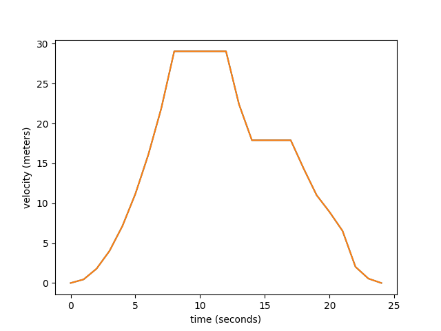
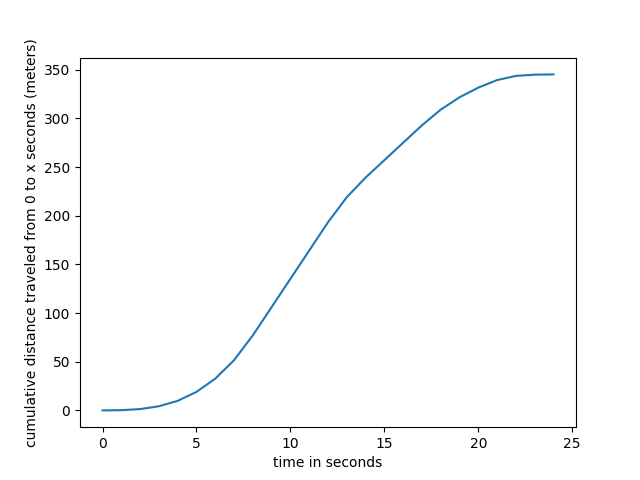

# gauss
Numerical Integration algorithms implemented in C++

Currently for functions of x. (may add support for higher dimensional functions later)

## Motivation
Why would one wish to numerically compute an integral? 

* Some integrals cannot be expressed in terms of elementary functions.

* It would be very difficult to write a program to attempt to integrate like a human does

* Related to the above reason, it is generally faster to numerically solve integrals (for a computer)

### An example

consider the integral 
$$\int_{-ln(2)}^{ln(2)}\frac{sin(x + x)^\frac{1}{3}}{e^x}dx$$

this integrand is unlikely to have a closed form solution for its anti-derivative, let alone a convinient one. 

Lets use a trapezoidal approximation from gauss to see what this integral is.

First we will need to define the integrand as a C++ function which takes a double, x, and returns a double

There is a catch, however, if we implement it as 

```C++
#include <cmath>

double f(double x) {
    return std::pow(sin(x + x), 1.0/3.0) / exp(x);
}
```

the approximation will fail. Upon further inspection you will notice that for negative arguments the function returns nan. This is because sin(x + x) will be negative. std::pow() returns NaN when the base is negative and the exponent is not an integer. 

To get around this we can just take the cube root of sin(x + x)

and the implementation is then 

```C++
#include <cmath>

double f(double x) {
    return cbrt(sin(x + x)) / exp(x);
}
```

For an approximation using gauss

```C++
#include <TRAPZ.h>

// f is assumed to be already defined elsewhere as the above function

int main(void) {
    double integral = TRAPZ(&f, 25, -log(2.0), log(2.0));
    std::cout << integral << std::endl;
}
```

the integral is then approximately -0.46573.

# TODO
Simpsons Rule (1/3, 3/8), Quadratures, Reimann Sums, Romberg Method.

## TRAPZ
The Trapezoidal rule approximates the definite integral of a function f over an interval [a, b] by summing up the areas of N trapezoids.

Symbolically it is given as:

$$\int_a^bf(x)dx \approx \frac{b-a}{2N} \sum_{n=1}^{N}[f(x_n)+f(x_{n+1})]$$

$$= \frac{b-a}{2N}[f(x_1) + 2f(x_2) + ... + 2f(x_{N-1}) + f(x_{N})]$$

and the spacing between $x_i$ and $x_j$ is $\frac{(b - a)}{N}$

if the spacing between the trapezoids is not a constant the rule is generalized as:
$$\int_a^bf(x)dx \approx \frac{1}{2} \sum_{n=1}^{N}(x_{n+1} - x_n)[f(x_n)+f(x_{n+1})]$$

### Using TRAPZ.cpp
```cpp
#include <iostream>
#include <TRAPZ.h>

// Integrate x^2 from 1 to 5 (exact result is 41 * 1/3)
double f(x) {
    return x*x;
}

int main(void) {
    // Trapezoidal approximation using 8 trapezoids
    double integral = TRAPZ(&f, 8, 1, 5);
    std::cout << integral << std::endl;
}
```

Sometimes it is desireable to integrate a discrete dataset.

TRAPZ is overloaded to handle different types of inputs.
If a set of points [f(a), f(x1), ..., f(b)] is given with unit spacing
```cpp
int main(void) {
    std::vector<double> X = {1.0, 4.0, 9.0, 16.0, 25.0};
    double integral = TRAPZ(X);

    std::cout << integral << std::endl;
}
```

this is equivalent to the MATLAB code

```MATLAB
X = [1 4 9 16 25];
Q = trapz(X)
```


If one provides a domain vector (a vector of x coordinates), and a reference to a function 

```C++
constexpr pi() { return 4*atan(1); }

double f(double x) {
    return sin(x);
}

int main(void) {
    // [0, π] with a step size of π/100
    std::vector<double> X;
    X.reserve(101);
    for (double x = 0.0; x < pi(); x += pi()/100.0) {
        X.push_back(x);
    }

    double integral = TRAPZ(X, &f);
    std::cout << integral << std::endl;
}
```

the equivalent MATLAB code
```MATLAB
X = 0:pi/100:pi;
Y = sin(X);
Q = trapz(X,Y)
```

## CUMTRAPZ

CUMTRAPZ computes the cumulative integral of f over the interval [a, b]
ie: it returns a vector of integrals where the ith integral is 
$$\int_a^if(x)dx$$
and is numerically approximated with TRAPZ
it is intended to function like MATLAB's cumtrapz function and is included in the TRAPZ.h header file

CUMTRAPZ therefore supports integration over discrete datasets

an example, computing the cumulative integral of 
$$\int_1^5x^2dx$$

```C++
#include <TRAPZ.h>

double f(double x) {
    return x*x;
}

int main(void) {
    std::vector<double> cums = CUMTRAPZ(&f, 15, 1, 5);
    std::for_each(cums.begin(), cums.end(), [](const double& x){std::cout << x << " ";})
}
```

```console
>>> 0 2.33407 8.67259 21.02 41.3807 
```

to integrate over a discrete dataset

```C++
int main(void) {
    // x^2 over [1, 5]
    std::vector<double> X = {1, 4, 9, 16, 25};
    std::vector<double> cums = CUMTRAPZ(X);
    std::for_each(cums.begin(), cums.end(), [](const double& x){std::cout << x << " ";})
}
```

```console
>>> 0 2.5 9 21.5 42 
```

this is in agreement with the MATLAB code
```MATLAB
X = [1 4 9 16 25];
Q = cumtrapz(X)
```

### A worked example
To better illustrate how cumtrapz is used, consider the discrete dataset

```MATLAB
[0, .45, 1.79, 4.02, 7.15, 11.18, 16.09, 21.90, 29.05, 29.05, 29.05, 29.05, 29.05, 22.42, 
17.9, 17.9, 17.9, 17.9, 14.34, 11.01, 8.9, 6.54, 2.03, 0.55, 0]
```
this data represents the velocity in meters per second of a particularly fast cat.
It looks like this: 
```python
import matplotlib.pyplot as plt
s = [0, .45, 1.79, 4.02, 7.15, 11.18, 16.09, 21.90, 29.05, 29.05, 29.05, 29.05, 29.05, 22.42, 17.9, 17.9, 17.9, 17.9, 14.34, 11.01, 8.9, 6.54, 2.03, 0.55, 0]
plt.plot(s)
plt.xlabel('time (seconds)')
plt.ylabel('velocity (meters)')
plt.show()
```


To find the total distance traveled by the cat after 24 seconds we can use a Trapezoidal approximation.
```C++
#include <TRAPZ.h>

static std::vector<double> dataset = {0, .45, 1.79, 4.02, 7.15, 11.18, 16.09, 21.90, 29.05, 29.05, 29.05, 29.05, 29.05, 22.42, 17.9, 17.9, 17.9, 17.9, 14.34, 11.01, 8.9, 6.54, 2.03, 0.55, 0};

int main(void) {
    double distance = TRAPZ(dataset);
    std::cout << "The distance traveled by the cat from 0 seconds to 24 seconds is: " << distance << " meters";
}
```

```console
>>> The distance traveled by the cat from 0 seconds to 24 seconds is: 345.22 meters
```

But what is the cumulative distance traveled? Simply use CUMTRAPZ.

```C++
std::vector<double> cums = CUMTRAPZ(dataset);
``` 

as a matter of interest, here is the cumulative distance plotted in Python using matplotlib



* The data was, in reality, about a car. It is more interesting if it is a cat. 
    * the data is taken from [this MATLAB tutorial on Integrating Discrete Datasets](https://www.mathworks.com/help/matlab/math/integration-of-numeric-data.html)
